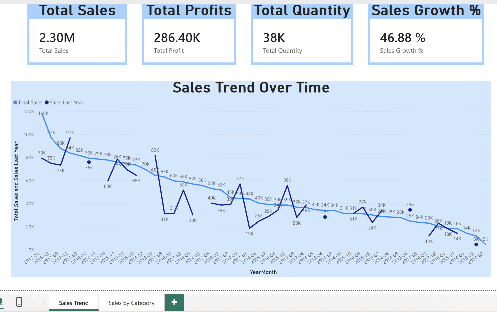
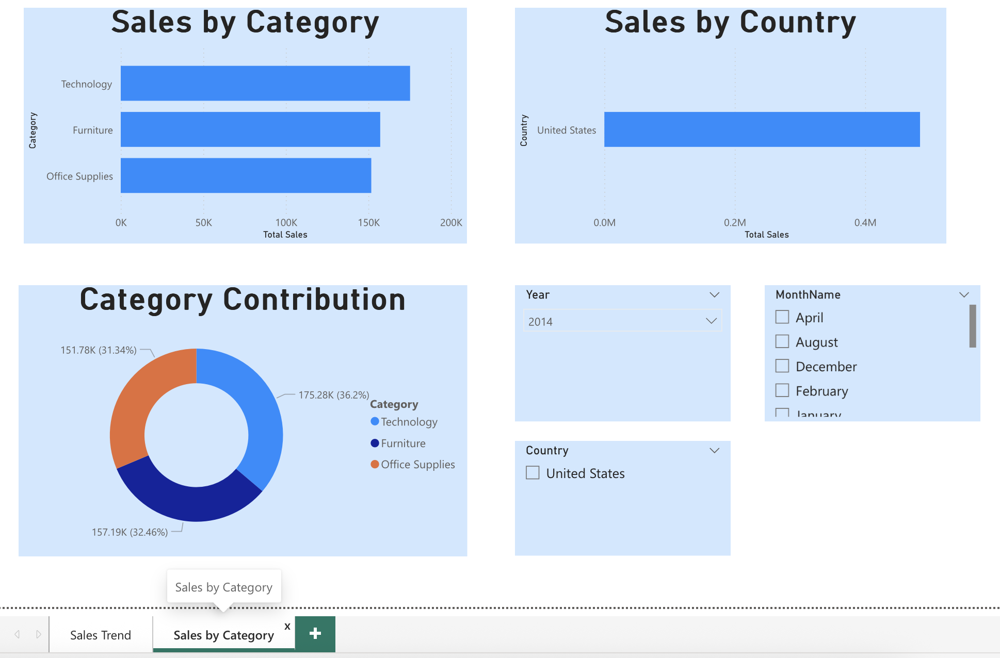

# Superstore Sales Analytics Dashboard

**End-to-End Retail Sales Analysis using Python and Power BI**

## 📊 Project Overview
Built an interactive Power BI dashboard to analyze **$2.3 Million** in total sales and **$286K** profit from the Superstore retail dataset.

## 🛠️ Technologies Used
- **Python** (pandas) – Data cleaning & feature engineering
- **Jupyter Notebook** – Data preprocessing
- **Power BI** – Interactive dashboard creation

## 📁 Project Files
- `clean_store.ipynb` → Data cleaning and feature engineering
- `Sales Data Analysis.pbix` → Main Power BI dashboard
- `clean_store_data.csv` → Cleaned dataset
- `raw_data.csv` → Original raw data
- `screenshots/` → Dashboard images

## ✨ Key Features
- KPI Cards (Total Sales, Profit, Quantity, Sales Growth %)
- Monthly Sales Trend with YoY comparison
- Breakdown by **Category** and **Country**
- Category contribution donut chart
- Interactive slicers for filtering

## 📸 Dashboard Screenshots

## 🚀 How to View
1. Download `Sales Data Analysis.pbix`
2. Open it using **Power BI Desktop** (free)
3. Use the slicers to explore the data

## 📈 Key Insights
- Technology category contributes the highest profit
- Furniture has high sales but lower profit margins due to discounts

---

**Made by Phoo Pyae Thaw**  
